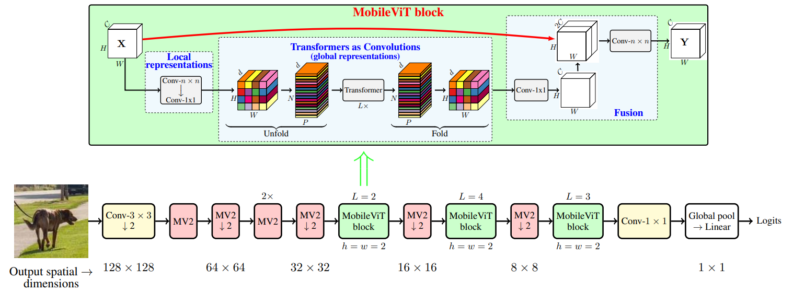
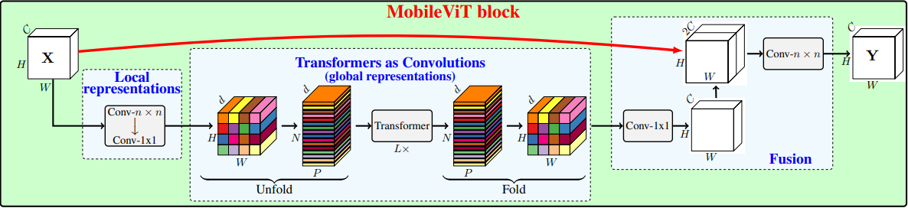
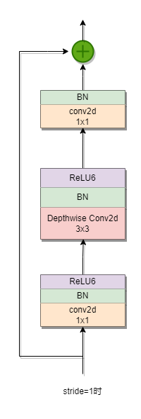

# Mobile ViT网络模型简述

  

## MobileViT block
  
该网络的核心部分，MobileViT Block，从左到右依次是：
1. Local representations: 由两个常规卷积层组成，第一层卷积核大小为nxn，主要作用是对原图进行局部特征建模，
第二层卷积核大小为1x1，主要作用是调整通道数。  
2. Global representations: 扩散卷积可以实现全局特征表征，但扩散卷积的扩散因子需要精心设计，作者采用transformer模型来实现全局特征表征。
在Unfold里，对输入进来的三维向量(H,W,d)，线性均分为N个patches(h,w,d),N=(H/h)*(W/w)，在P维度切分成N*d的平面，输入到Transformer模型，
Fold再讲输出的结果进行还原。
3. Fusion：对input进行还原，还原到初始形态，然后从初始形态引来一个捷径分支，和其进行concat拼接，再进入一层卷积。

## MobileNetV2 Block
Inverted residual block(bottleneck)
倒残差结构是先升维再降维。  

