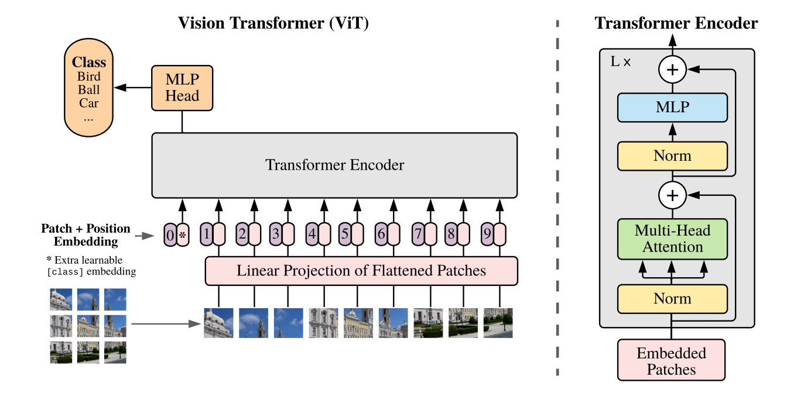
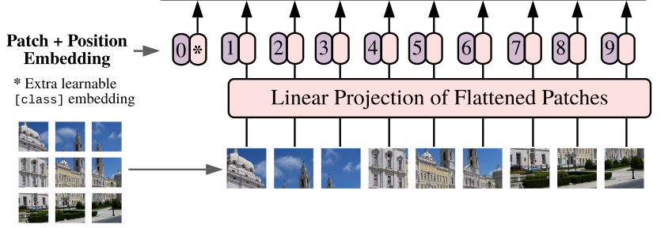
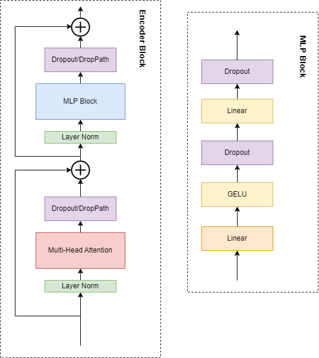
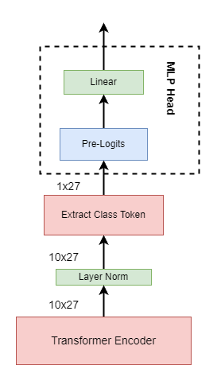

# Vision Transformer模型

## Embedding层

由于Transformer Encoder要求输入的是n个一维向量(token)，需要对三维图像（包含通道）进行一系列变换，
以符合输入要求。变换时尽量满足：  
1. 满足输入形式要求；
2. 包含位置信息；
3. 对分类有一定帮助；

该过程分三步走：  
以上图为例，假设原图尺寸为[9, 9, 3]。  
第一步，使用3x3卷积核，步距为3，和原图卷积，得到9个尺寸为[3, 3, 3]的patches，将每个patches线性展开为一维向量(token)，
满足输入形式要求，至此数据形式变为[9, 27]，第1维是token数，第2维是每个token的长度。  
第二步，引入class token，帮助分类。至此数据形式变为[10, 27]。  
第三步，引入位置编码，使原图经过一系列变换后，仍然保留位置信息。位置编码的数据形式和第二步一样，
然后进行相加操作，数据形式不变，仍然是[10, 27]。   

## Transformer Encoder  
  
1. Dropout/DropPath: 是指原论文用的是Dropoout，但在其他的实现版本中有用的是DropPath,其效果可能更好一些。  
2. Linear：是指全连接层。  

## MLP Head

- Extract Class Token: 直接丢弃后9行；
- Pre-Logits: 如果进行了Extract Class Token，Pre_logits相当于nn.Identity();